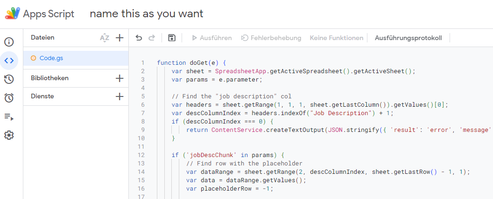
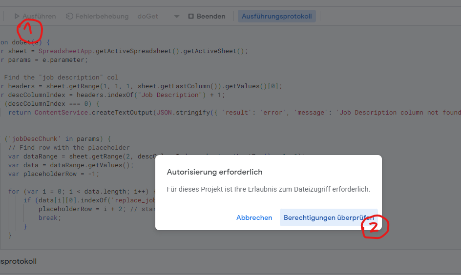
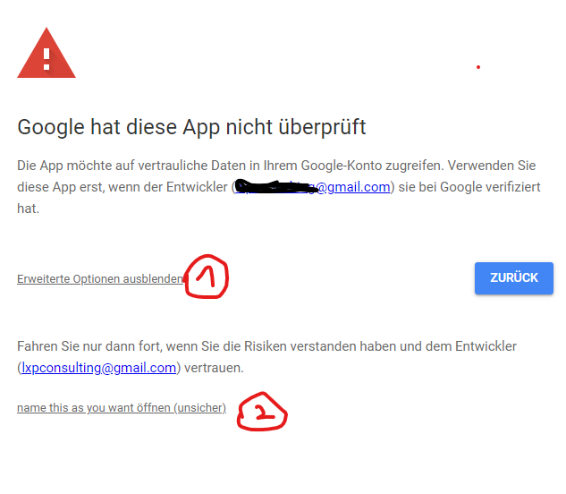

# Job to Sheets for LinkedIn 
Enables you to click one bookmarklet/button to turn a currently open LinkedIn job page into structured data and send it to a Google Sheet, appended to the last row.

## Parts: Bookmarklet + Apps Script
This job hunting helper consists of two parts:

1. A bookmarklet that you click on while having a LinkedIn job page open. It passes on the data to...
2. ...A Google Apps Script (that you have to turn into a web app with url endpoint). It processes and appends incoming "structured" job offer data rows to the Google sheet it is bound to.

## Setting it up

1. Create a new Google Spreadsheet. Important - Add header column names ("Job Description" is crucial): `Job Title,Page URL,Work Type,Company Name,Location,Job Description`
2. Open `Extensions > Apps Script` and replace the default function you see ("myFunction") with the content of <a href="appsScript.js">appsScript.js from this repo</a>. 
3. Click on the little save icon
4. Grant the app permissions to run the first time. It will tell you this code was not reviewed by Google. You can grant it permission anyway, by clicking on the 'Extended' option and then accept it to run.   
5. It will show an error in the console when you run it the first time, which is fine and can be ignored
6. Click the blue "Deploy" button in the top-right corner of the page. Then, create a new deployment
7. Select "Web App" as type. Other setting: Run as "your account", accessible to everyone. Deploy and copy the Web App URL
8. Save the <a href="bookmarklet-generator-alexpaul.io.html">bookmarklet-generator-alexpaul.io.html</a> to your machine and open it with your browser.
9. Insert the Web App URL and click "Generate".
10. Drag the Bookmark into your Bookmarks bar of the browser.

Test it: 
- Open a LinkedIn job page (make sure the url looks similar to this one: https://www.linkedin.com/jobs/view/12345678)
- Click on the bookmarklet. It will pass on the data to your web app and return "success" in best case ;-)

## TBD / Further needed improvement:
- [ ] Some job descriptions might be too long to pass via the web app, that's why I created a chunking mechanism. However, I cant make it work anymore for "fresh deployments". It still works for my first deployment but I can't find the issue